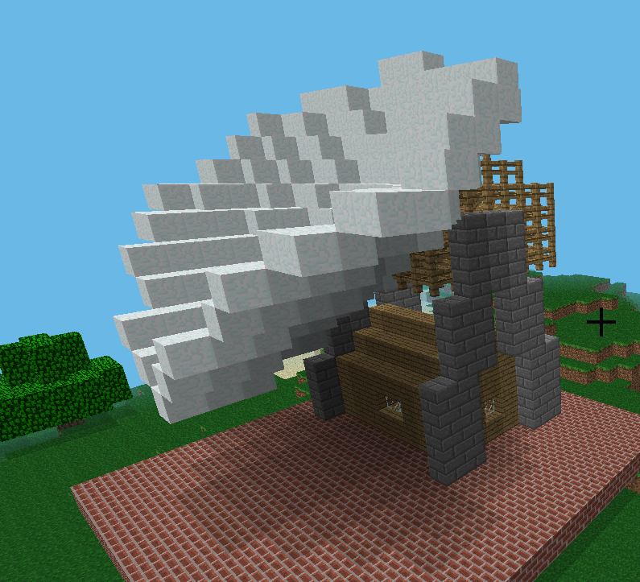

# Goonhilly-Arthur-Satellite-Dish-in-Minecraft
Build the famous satellite dish on the Cornish Lizard in Minecraft.

These instructions utilise some code to build the base directly within Minecraft. 
Onto this base an index of all the blocks is used to build the actual dish.
The arthur_blocks.py file will need ot be in the same folder as the code being created for it to work.
